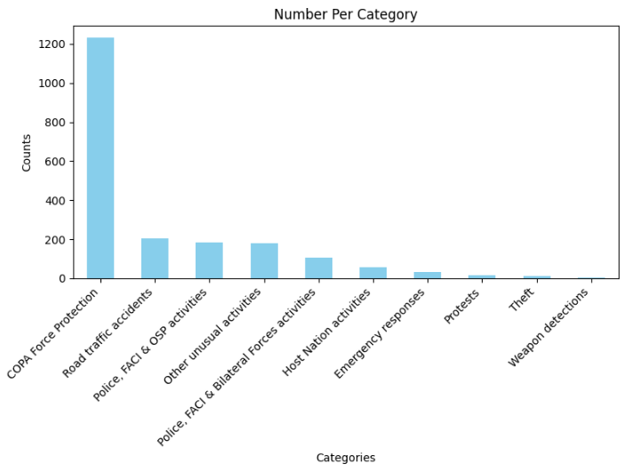
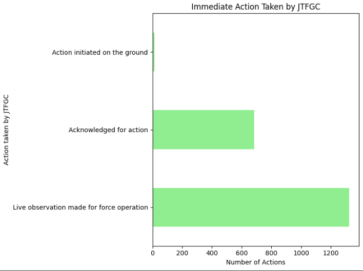

Stanford University Code in Place Final Project
Overview
This repository contains my final project for the Stanford University "Code in Place" program. The project focuses on data visualization and analysis of surveillance activities within the operations center of the fictional Gondwana City.

Project Description
The project utilizes Python to analyze and visualize surveillance data, showcasing various aspects of the operations within the city's tactical operation center. This includes:

Data Analysis: Processing and analyzing surveillance data to extract meaningful insights.
Visualization: Creating interactive and static visualizations to represent the data effectively.
Key Features
Incident Analysis: Visualizing the frequency and types of incidents captured by surveillance cameras across different locations in Gondwana City.
Action Taken by JTFGC: Analyzing and visualizing the immediate actions taken by the Joint Task Force of Gondwana City (JTFGC) in response to surveillance footage.
Camera Usage: Representing the utilization of different surveillance cameras in various parts of the city.
Tools and Technologies
Python: The primary programming language used for data analysis and visualization.
Pandas: For data manipulation and analysis.
Matplotlib: For creating detailed and informative visualizations.
Jupyter Notebook: For an interactive coding and data visualization environment.
Objectives
Demonstrate competence in handling and analyzing large datasets.
Showcase the ability to create meaningful visualizations that aid in understanding complex data.
Highlight the importance of surveillance in maintaining city security and the effectiveness of the JTFGC.
How to Use
Clone the Repository
bash
Copy code
git clone https://github.com/your-username/finalproject_CIP.git
Navigate to the Directory
bash
Copy code
cd finalproject_CIP
Run the Jupyter Notebook
bash
Copy code
jupyter notebook
Explore the provided Jupyter notebook to see the complete analysis and visualizations.

Repository Topics
Data Analysis: Extensive data analysis focusing on surveillance activities within Gondwana City’s operations center.
Python: Implemented using Python, showcasing its powerful libraries for data manipulation and visualization.
Pandas: Utilized for data cleaning, transformation, and analysis.
Matplotlib: Used for creating detailed visualizations.
Jupyter Notebook: Interactive environment for coding and visualizing data.
Surveillance Data: Dataset detailing incidents, actions taken by authorities, and camera usage in Gondwana.
Data Visualization: Clear and informative visualizations to aid in understanding complex datasets.
Security Operations: Analysis of data related to security operations by the Joint Task Force of Gondwana City (JTFGC).
Incident Management: Categorizing and visualizing different types of incidents captured by surveillance cameras.
Operational Efficiency: Enhancing operational efficiency of security forces through data analysis and visualization.

### Number of Type of Incidents and Events

### Type of Action Taken by the Duty Officer (JTFGC)

### Cameras usage

### Category of Incident and Events spotted

### Operators' Performance

Contact
For any questions or feedback, please contact [sidientreprise@gmail.com].
